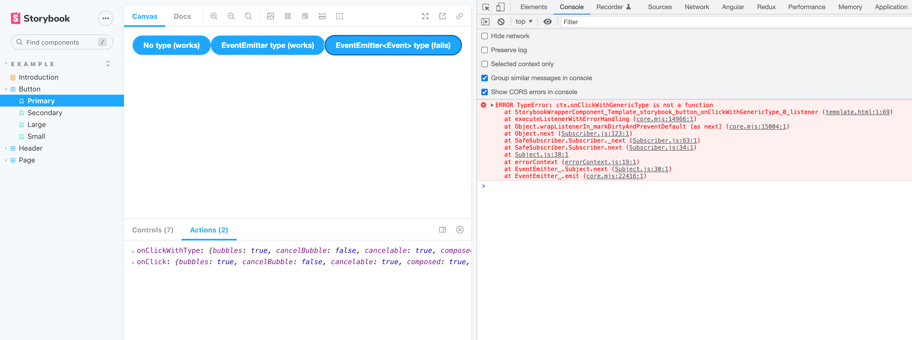

# Bug report

### Description
When you type an Angular `@Output()` event emitter with a generic type - like `@Output() onClick: EventEmitter<Event> = new EventEmitter<Event>();` - then this output event will throw an error when the Storybook action is dispatched: `ERROR TypeError: ctx.onClick is not a function`

This seems to be related to the generic type of the `EventEmitter`, for example:

```ts
/** Omitting the type => will work */
@Output() onClick = new EventEmitter<Event>();

/** Ignoring the generic type => will work */
// @ts-ignore
@Output() onClickWithType: EventEmitter = new EventEmitter<Event>();

/** Using a generic type => will throw error */
@Output() onClickWithGenericType: EventEmitter<Event> = new EventEmitter<Event>();
```

### How to reproduce
Just run the following command:

```shell
yarn && yarn storybook
```

and then go to the Story for the button: http://localhost:6006/?path=/story/example-button--primary

Clicking the first 2 buttons will show an output in the "Actions" tab, but the last button will throw an error in the console:


